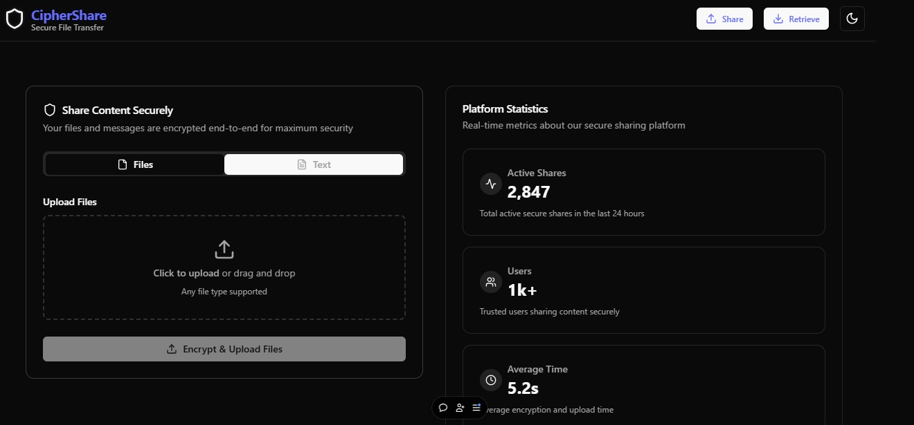

<h1 align="center"> Ciphershare </h1>
<p align="center">
  
</p>

####  A secure file-sharing platform that enables users to upload, share, and download files with enhanced privacy and security measures. 

## Technology used: 
- React
- Typescript
- Tailwind CSS
- Radix UI
- Node.js
- Express.js
- MongoDB
- Azure Blob Storage

## Features:
- File upload and download with Azure Blob Storage integration
- Secure file sharing with unique links for each file
- Responsive and modern UI for an enhanced user experience

## Project Setup

1. **Clone the repository**
```bash
git clone https://github.com/Vinaymore1/CipherShare.git


2. **Navigate to the project directory and install dependencies for the backend**
bash
cd CipherShare
cd backend
npm install


3. **Create the environment variables for the backend & update the .env file with your  credentials**
bash
create .env
AZURE_STORAGE_CONNECTION_STRING = "your string" 
AZURE_STORAGE_CONTAINER_NAME = "container name "


4. **Start the backend server**
bash
npm run dev


5. **In a new terminal, navigate to the frontend directory and install the dependencies**
bash
cd ../frontend
npm install


6. **Copy the environment variables for the frontend and update the lib/api file with the backend URL for CORS** 


7. **Start the frontend development server**
bash
npm run dev 